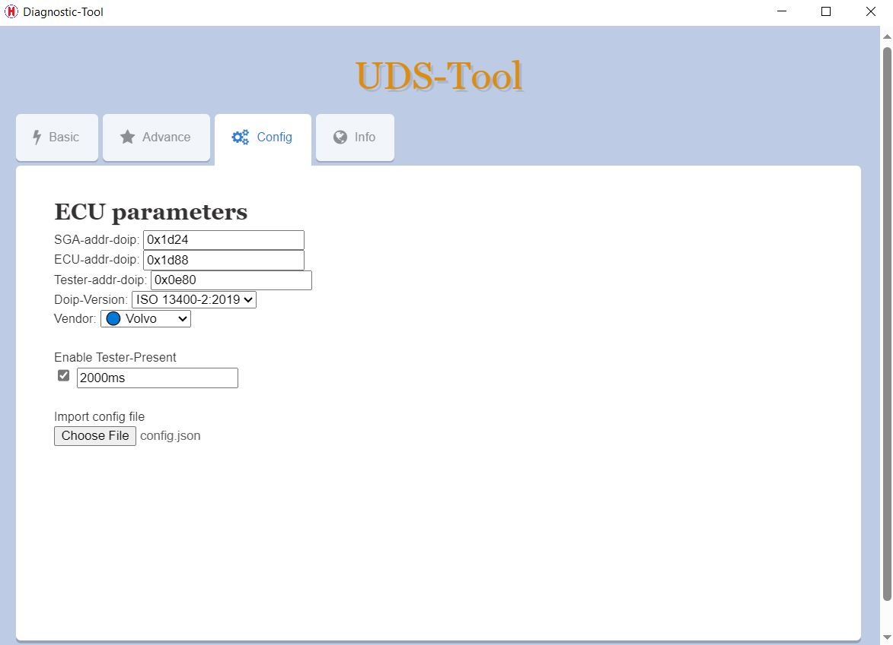
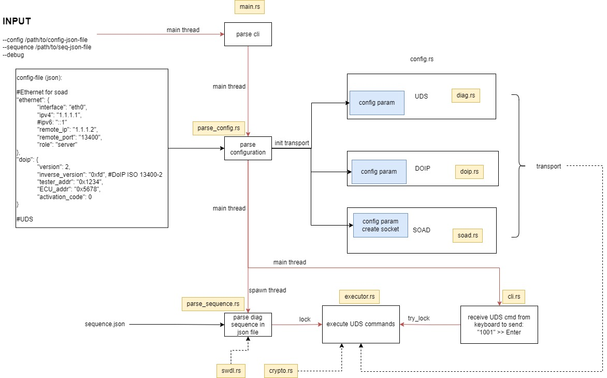

## Description
Rust project that can do diagnostic in ECU-Autosar via ethernet.
Should work on both Linux&Windows

## Main Flow

## Setup
For Linux/MacOS install cargo by "curl https://sh.rustup.rs -sSf | sh". Install some dependencies if needed 
For Window, download and install cargo at https://win.rustup.rs/ 

## Build
There are 2 modes for building, 1 for GUI application and 1 for CLI. Open cmd/terminal and use 1 command below: 
cargo build --no-default-features --features "cli" --release 
cargo build --no-default-features --features "cli" 
cargo build --features "gui" --release 
cargo build --features "gui" 

## Execute
./target/debug/diag_tool --debug --config json/config.json --sequence json/sequence.json

## JSON explaination
.....

## TODO list

<s>Work well in Linux&Window</s>

<s>Support run Diagnostic sequence</s>

<s>Support Security-Access Diag</s>

<s>Support SWDL for hex, S37, vbf format</s>

<s>Support send tester-present cyclic feature</s>

Lock json folder by password to protect sensitive data (OEM keys)

<s>Support execute CLI cmd from terminal (send diag cmd)</s>

Support IPv6

<s>Support Debug-log</s>

Full-compliance for ISO13400

Full-compliance for ISO14229-1 3rd

Support TLS for DoIp layer

<s>Support GUI</s>

Calculate response time

Handle error code

Support to export test report for sequence

## DEMO

## TESTING

    
Test-cases

